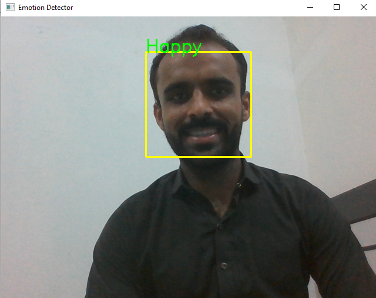
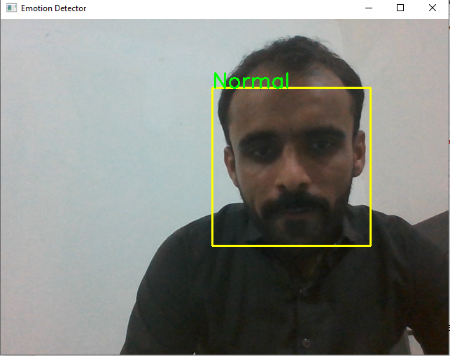
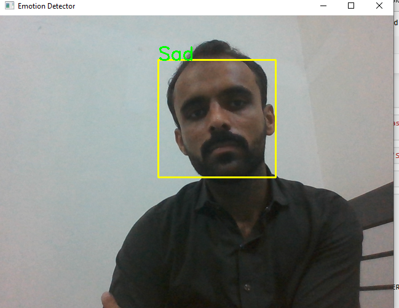
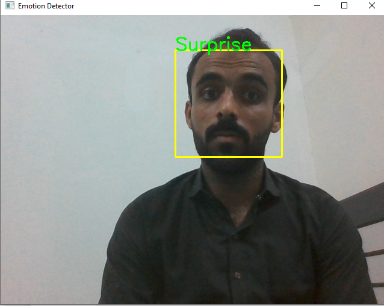

# Real Time Face Emotions Detection

This project aims to implement a real-time face emotions detection system using computer vision techniques.The system can detect and classify human emotions based on their facial expressions.

## Features

Real-time face emotions detection from webcam.

Classification of emotions including but not limited to happy, sad, angry, surprised, and neutral.

High accuracy in detecting and classifying emotions.

## Glimpes of the Project

## Usage 
1. Connect a webcam or a camera to your system.

2. Run the code.

3. Detected faces will be highlighted, and their corresponding emotions will be displayed in real-time.

## Contributions 

Contributions to the project are highly encouraged. If you encounter any issues or have ideas for enhancements, please feel free to open an issue or submit a pull request.
